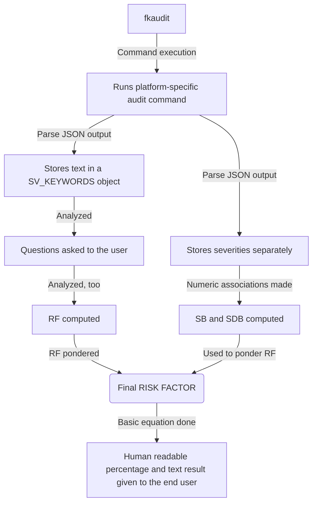
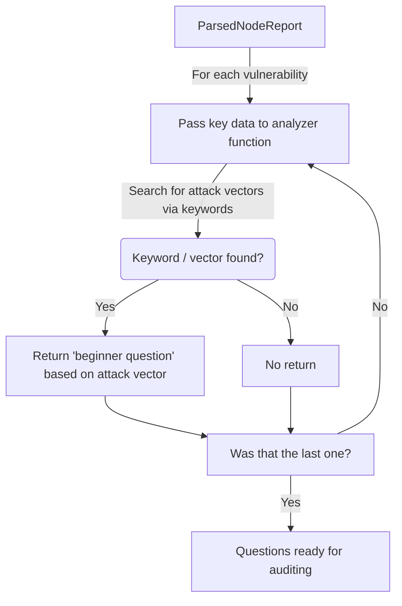
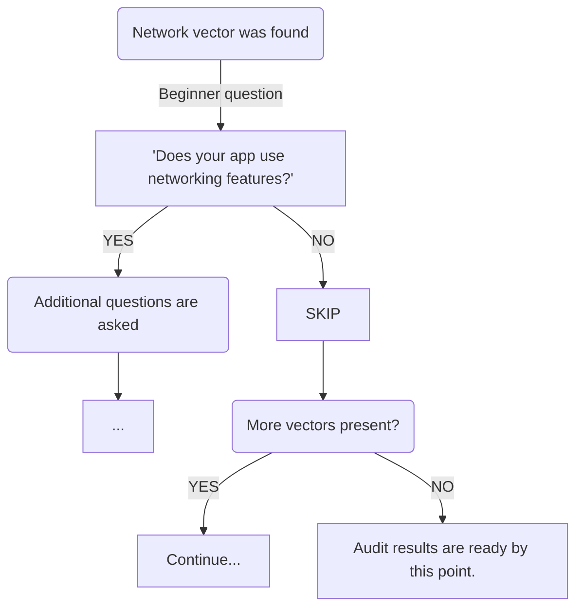

# Audit

An attempt to make security reports easier.

## Abstract

We will explain this  with a real life example - I, the creator of F\*ckingNode, have been working on a mobile React Native app, which once became affected by a `low` severity vulnerability, related to cookies. The thing is, fixing it implied breaking changes (as `expo-router` had a dependency that had a dependency that had a... until one that depended on the vulnerable version).

However, as a mobile app that never interacted with cookies and very rarely used HTTP or the web themselves, turns out the breaking changes _were not "worth it"_.

**Sometimes that is the case, a vulnerability is not really a concern.** However, it can be hard to analyze if you really should just let it go, or if it is a vulnerability that can really hurt your project. _**That is what we made this feature for.**_

### TL;DR

`fuckingnode audit` analyzes vulnerabilities and helps you tell if they really affect your project or if they can be left alone without too much risk.

## How it works

The process is as follows:

- We analyze your vulnerabilities
- A questionnaire is made based on present attack vectors
- Your responses are used to prompt additional questions depending on your responses
- A final **risk factor** (percentage) is calculated and shown to you.

Due to where nowadays society is heading, it _is_ worth noting questions are not AI generated whatsoever.

### Step one: analysis

We perform a regular audit your project, and then we realize a keyword analysis from where we obtain **key questions** based on vectors.

We search for keywords like `network`, `cookie`, or `console` which define "attack vectors". For each vector that is present, we return a "beginner question" for the auditing process. These "beginner questions" are the entry point of each vector's auditing flow - in other words - if the `network` vector _is_ found you will be first asked if your app does make usage of any kind of networking features, asking you more specific questions about your usage if you respond "yes", or skipping the vulnerability if otherwise, considering it is probably a vulnerable dependency _of a dependency of a dependency..._ that does not really affect you.

### Step two: interrogation

As noted above, we will "interrogate" your usage of features. It is a simple YES/NO flow, like in this illustrated example:

Each question returns either `+1` or `+2` to be added to either the positive count or the negative count, as described right below.

### Step three: evaluation

Your questions are evaluated using a straightforward positive-negative system: responses indicating 'positive' information add up to the positive count, while those indicating 'negative' information add up to the negative count.

These counts and the SB and SDB values are used to compute the RF, a risk percentage where 0 means _safe to ignore security updates_ and 100 means _absolutely necessary to perform security updates_. The RF is computed based on the following formula. It is worth noting that, because of the unreliability of a non-human scan, we take a more complex approach so that we can intentionally increase the RF by pure mathematic means, using the SB and SDB.

\[
T = P + (N \cdot S_d)
\]

\[
\text{RF} =
\begin{cases}
0, & \text{if } T = 0 \\
\min\left(100, \max\left(0, \dfrac{N \cdot S_b}{T} \cdot 100\right)\right), & \text{otherwise}
\end{cases}
\]

\[
\text{where:} \quad
\begin{aligned}
P &= \text{positives} \\
N &= \text{negatives} \\
S_d &= \text{severityDeBump (indirectly bumps RF)} \\
S_b &= \text{severityBump (directly bumps RF)}
\end{aligned}
\]

SB and SDB values are as follows:

| Severity |   SB |  SDB |
| :------- | ---: | ---: |
| critical | 2.00 | 0.25 |
| high     | 1.75 | 0.50 |
| moderate | 1.50 | 0.75 |
| low      | 1.25 | 1.00 |

---

## Summary

FuckingNode audit should not be allowed to have the final say over whether breaking-changes-packed security fixes should be applied or not. It is only meant to provide an estimate, in order to help you make a clearer decision. We will still always encourage you to resolve any vulnerability that you're capable of.

---

## Availability

Where `EXP` indicates only experimental support, and `YES` and `NO` indicate the obvious.

| Support    | NodeJS npm | NodeJS pnpm | NodeJS yarn | Deno | Bun | Go | Cargo |
| :--------- | ---------- | ----------- | ----------- | ---- | --- | -- | ----- |
| v3.3.0     | YES        | YES         | YES         | NO   | NO  | NO | NO    |
| v3.0.0     | EXP        | EXP         | EXP         | NO   | NO  | NO | NO    |
| v2.1.0     | EXP        | NO          | NO          | NO   | NO  | NO | NO    |

*[RF]: Risk Factor; a percentage computed by us to estimate the joint impact of all vulnerabilities of a NodeJS project.
*[SB]: Severity Bump; a 1.25-2 number that's used to bump the RF based on the highest severity (as in low/moderate/high/critical) of a found vulnerability within a project.
*[SDB]: Severity DeBump; a 0.25-1 number that's used to de-bump the negative count prior computing the RF based on the highest severity (as in low/moderate/high/critical) of a found vulnerability within a project.
